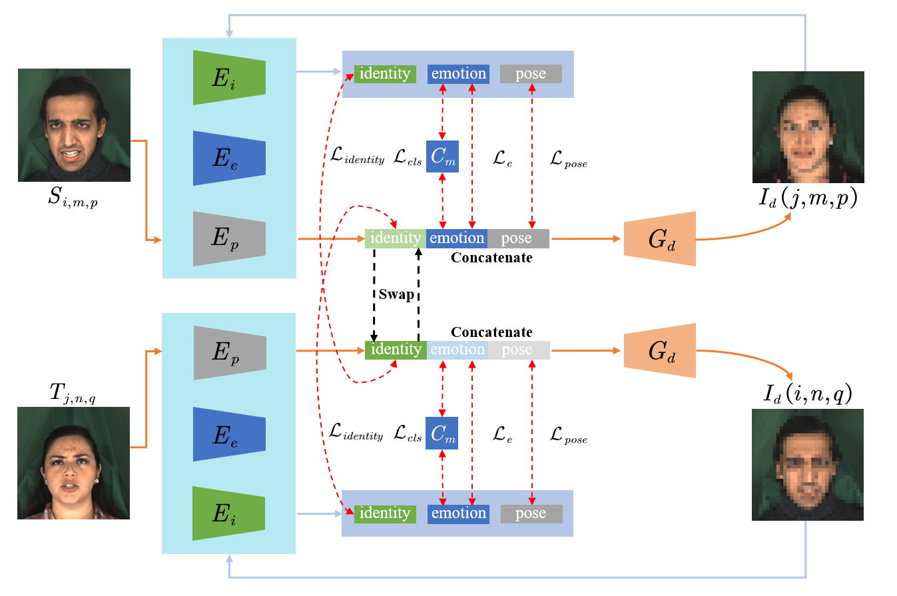

# Listen, Disentangle, and Control: Controllable Speech-Driven Talking Head Generation

Changpeng Cai1,2*, Guinan Guo 3*, Jiao Li 1*, Junhao Su 2*,
Chenghao He 5, Jing Xiao 1, Yuanxu Chen 1, Lei Dai 1, Feiyu Zhu 4†
https://arxiv.org/pdf/2405.07257

**MEAD:** 
A Large-scale Audio-visual Dataset for Emotional Talking-face Generation [ECCV2020]
https://github.com/uniBruce/Mead

**FEED:** 
Facial Extreme Emotions Dataset
https://github.com/neeek2303/FEED

**Affectnet** - use this 
https://www.kaggle.com/datasets/thienkhonghoc/affectnet

Inter-Reconstructed Feature disentanglement(IRFD)

